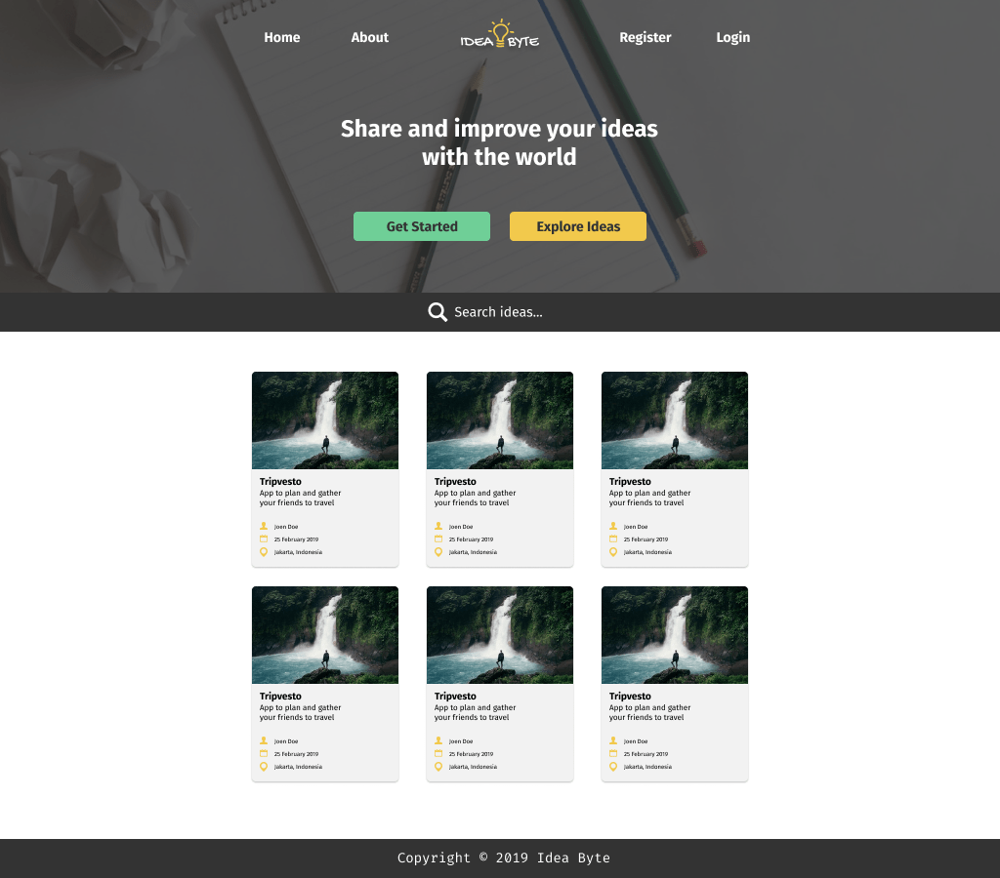
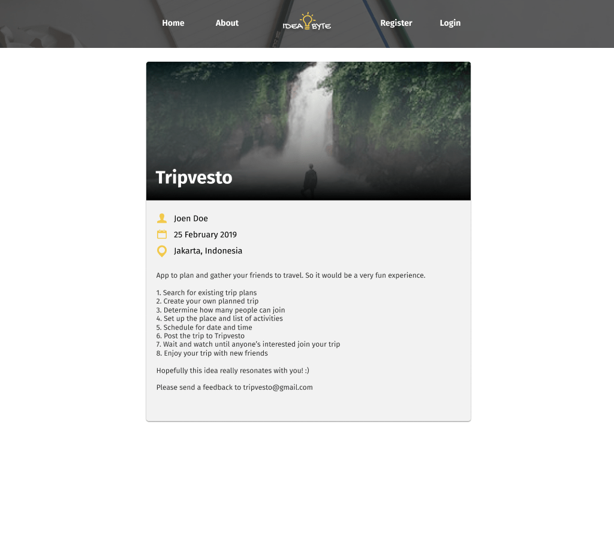
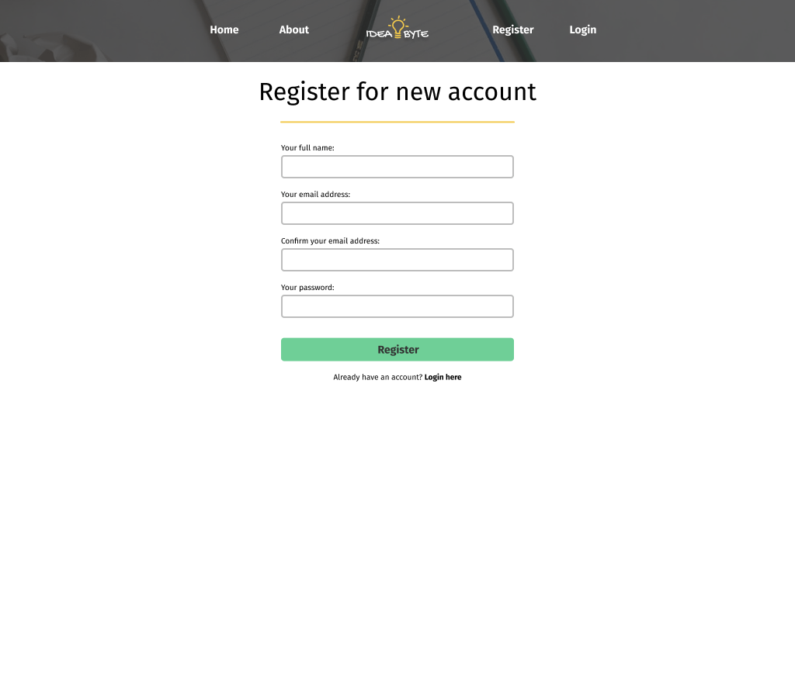

# Idea Byte Discussion + Design

This repo is to manage all discussion and design assets of Idea Byte.

<!-- vscode-markdown-toc -->

- 1. [Introduction](#Introduction)
- 2. [Links](#Links)
- 3. [Development Setup](#DevelopmentSetup)
- 4. [Features](#Features)
- 5. [Management Accounts](#ManagementAccounts)
- 6. [Technology & Design Stack](#TechnologyDesignStack)
- 7. [Design](#Design)
     _ 7.1. [Logo Design](#LogoDesign)
     _ 7.2. [UI & UX Design](#UIUXDesign)
- 8. [License](#License)

<!-- vscode-markdown-toc-config
	numbering=true
	autoSave=true
	/vscode-markdown-toc-config -->

<!-- /vscode-markdown-toc -->

## 1. Introduction

Let's build a full stack project in just 5 days.

- Monday: Design UI & UX in Figma, implement frontend components in React
- Tuesday: Give interactivity with Redux
- Wednesday: Implement backend REST API
- Thursday: Integrate frontend and backend
- Friday: Present full stack project with slide

## 2. Links

- Organization:
  - https://github.com/ideabyte
- Repositories:
  - https://github.com/ideabyte/ideabyte
  - https://github.com/ideabyte/ideabyte-frontend
  - https://github.com/ideabyte/ideabyte-backend

## 3. Development Setup

- Determine a team/app name
  - Example: Idea Byte
- Create a Gmail account
  - Example: impactbyte.ideabyte@gmail.com
- Create GitHub account
  - Example: https://github.com/ideabyte-admin (free personal account)
- Create GitHub organization
  - Example: https://github.com/ideabyte (team organization)
- Update organization profile in settings
  - https://github.com/organizations/ideabyte/settings/profile
- Add team members on GitHub
  - https://github.com/orgs/ideabyte/people
- Setup repositories
  - `primary`: https://github.com/ideabyte
  - `frontend`: https://github.com/ideabyte-frontend
  - `backend`: https://github.com/ideabyte-backend
- Protect `master` branches
  - https://github.com/impactbyte-ideabyte/ideabyte-frontend/settings/branches
- Setup project with linked repositories
  - Example: https://github.com/orgs/impactbyte-ideabyte/projects/1
- Protect `master` branches
  - https://github.com/ideabyte/ideabyte-frontend/settings/branches
- Setup project with linked repositories
  - Example: https://github.com/orgs/ideabyte/projects/1

## 4. Features

- List the features we NEED, not what we WANT
- List the issues on how to implement it
  - https://github.com/ideabyte/ideabyte/issues
- Display introduction in homepage (`/`)
- Display all ideas in homepage (`/ideas`)
- Display about in about page (`/about`)
- Register new user (`/register`)
  - Put full name
  - Put username
  - Put email
  - Put password
  - Register button
- Login with registered user (`/login`)
  - Put username
  - Put password
  - Login button
- Check our own profile (`/profile`)
  - Full Name
  - Username
  - Email
  - Password should not be displayed
  - Remove user button
    - Remove our own user/profile
- Check other user's profile (`/users/:username`)
- Create a new idea in the idea editor (`/create`)
  - Put the title
  - Put an image or multiple images
    - This will be a cover image
  - Put some description
  - Date and time created automatically
  - Submit idea
- See the idea on its own (`/ideas/:id`)
  - Cover image
  - Title
  - Description
  - Date and time
  - Author
    - Link to user's profile
  - Details
- Update idea in the idea editor (`/ideas/:id/edit`)
  - Update the title and description
  - Remove our own idea
  - Resubmit the idea

## 5. Management Accounts

`yourteamname@gmail.com`

- Gmail
- Google Chrome Profile
- Uniregistry
- Cloudflare
- Figma
- Netlify
- Heroku
- GitHub Personal Admin
- GitHub Organization
- The Noun Project
- Unsplash
- Grammarly

## 6. Technology & Design Stack

- Management
  - [Gmail](https://mail.google.com): managing all emails
  - [Google Keep](https://keep.google.com): storing secrets
  - [Google Drive](https://drive.google.com): storing variety of assets
  - [Google Slide](https://docs.google.com/presentation): making the presentation
  - [Git](https://git-scm.com): managing versions in a repository
  - [GitHub](https://github.com): managing repositories, with admin and organization
- Editor
  - [Visual Studio Code](https://code.visualstudio.com): developing the software
  - [Postman](https://getpostman.com): storing API collections
- Contents
  - [Figma](https://figma.com): designing the logo, UI, UX
  - [Unsplash](https://unsplash.com): getting sample photos
  - [unDraw](https://undraw.co): getting free SVG images
  - [The Noun Project](https://thenounproject.com): getting icons
  - [Grammarly](https://grammarly.com): checking the writing and grammar
- Frontend
  - HTML: layouting the page
  - CSS: styling the page
  - JavaScript (ESNext): making the website interactive
  - [React](https://reactjs.org): component-based design
  - [React Dev Tools](https://chrome.google.com/webstore/detail/react-developer-tools/fmkadmapgofadopljbjfkapdkoienihi): debugging React development
  - [React Router DOM](https://reacttraining.com/react-router/web): routing the React app pages
  - [React Helmet](https://www.npmjs.com/package/react-helmet): managing metadata in React
  - [React Spinners](https://www.react-spinners.com): showing loading spinner when loading content
  - [React Toastify](https://fkhadra.github.io/react-toastify): notifying information (success/error)
  - [React Content Loader](http://danilowoz.com/create-content-loader): showing skeleton of loading content
  - [Styled Components](https://www.styled-components.com): CSS in JS with `styled`
  - [Emotion](https://emotion.sh): CSS in JS
    - [`@emotion/styled`](https://emotion.sh/docs/@emotion/styled): CSS in JS with `styled`
  - [Draft.js](https://draftjs.org): rich editing HTML text format in form field
  - [Redux](https://redux.js.org): managing the state across the React app
  - [Redux Dev Tools](https://chrome.google.com/webstore/detail/redux-devtools/lmhkpmbekcpmknklioeibfkpmmfibljd): debugging Redux development
    - [Using Redux Dev Tools Extension as Middleware](https://github.com/zalmoxisus/redux-devtools-extension#13-use-redux-devtools-extension-package-from-npm)
  - [Redux Persist](https://www.npmjs.com/package/redux-persist): Persist and rehydrate a redux store
  - [Redux Middleware](https://redux.js.org/advanced/middleware): managing plugins in Redux
    - [Redux Thunk](https://www.npmjs.com/package/redux-thunk): managing asynchronous process in Redux
    - [Connected React Router](https://www.npmjs.com/package/connected-react-router): managing history in React Router & Redux
- Backend
  - [Node.js](https://nodejs.org): JavaScript in the backend
  - [Express](https://expressjs.com): making the REST API
  - [`bcrypt`](https://www.npmjs.com/package/bcrypt): securing the password, also with salt
  - [JWT (JSON Web Tokens)](https://jwt.io): managing authorization with token after login
    - [`jsonwebtoken`](https://www.npmjs.com/package/jsonwebtoken)
  - [NoSQL](http://nosql-database.org): non-relational database
    - [MongoDB](https://www.mongodb.com): document-based database
    - [Robo 3T (formerly Robomongo)](https://robomongo.org/download): managing MongoDB data
    - [Mongoose](https://mongoosejs.com): ODM (Object Data Modeling) for MongoDB
  - SQL: relational database
    - [MySQL](https://www.mysql.com/products/community): table-based database
    - [MariaDB](https://mariadb.org): table-based database
    - [MySQL Workbench](https://www.mysql.com/products/workbench): designing and managing MySQL data
    - [Knex.js](https://knexjs.org): SQL query builder
    - [Objection.js](https://vincit.github.io/objection.js): ORM (Object Relational Mapping) for MongoDB
- Server
  - [Netlify](https://www.netlify.com): hosting the frontend web application
  - [Heroku](https://heroku.com): hosting the backend REST API in PaaS
    - [Heroku mLab](https://elements.heroku.com/addons/mongolab): hosting MongoDB in Heroku
    - [Heroku Postgres](https://www.heroku.com/postgres): hosting PostgreSQL in Heroku
    - [Heroku ClearDB MySQL](https://elements.heroku.com/addons/cleardb): hosting MySQL in Heroku
    - [https://elements.heroku.com/addons/jawsdb-maria](https://elements.heroku.com/addons/jawsdb-maria): hosting MariaDB in Heroku
  - [Digital Ocean](https://www.digitalocean.com): hosting any application in VPS
  - [Google Cloud Platform](https://cloud.google.com/gcp)
    - [Google Compute Engine](https://cloud.google.com/compute): hosting all applications
- Domain
  - [Uniregistry](https://uniregistry.com): registering the domain
  - [Cloudflare](https://www.cloudflare.com): managing the DNS (Domain Name Server) between domain and server
- Social Media
  - [Twitter](https://twitter.com)
  - [Facebook](https://www.facebook.com)
  - [Instagram](https://instagram.com)

## 7. Design

### 7.1. Logo Design

Figma: https://www.figma.com/file/Ulv3rNFBEvLpAYVQKyrQUf7R/Logo

### 7.2. Desktop Design

Figma: https://www.figma.com/file/fnUhskd1moNIQIefbwC0eknE/Desktop

## 8. License

- MIT License
- Creative Commons Attribution-NonCommercial-ShareAlike 4.0 International License

Thanks to [Unsplash](https://unsplash.com) and [The Noun Project](https://thenounproject.com).
